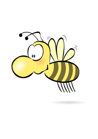

	
	<h1>The new bee hive</h1>
	
Example to explain how Narratives work

---

Hello, my name is Daniel. I am a DevOps engineer at Wandelbots, and I want to
invite you to "The new bee hive" – a document using a narrative format that can
be used to provide information and drive decisions.

This format is commonly used at Amazon to decide on critical changes, new
features, but also management decisions. We are also using it on some FOSS
(free and open source software) projects, too. It can be adapted to mailing
lists, written documents, describing changes or seeking support.

Let’s create an example on how to use the narrative format using bees and the
birth of a new queen.

---

Word buzzes from the honeycombs of the bee stock, “A new queen is born”. A clear
sign that a new era has begun. The birth of a new queen is an event unknown to
the bee population and everybody is eager to see her. Slowly, concerns are
raised, *"What shall we do with two queens?"*, *"What happens with our current
queen?"*, *"Do we need to generate double the honey now?"*.

In one particular honeycomb, a worker bee in the midst of repairing a hole
thinks about the situation. She’s a typical worker bee – yellow with black
stripes, the typical fur and 6 legs, a sting – but she prides herself on her
rather unusual bee name, Buzzeny.

When Buzzeny once collected pollen, she overheard some of the bizz and buzz from
other hive’s bees. They had talked about their colony’s origins, how they grew
it and mentioned the wise bees sitting in the honey tavern rambling about *“the
old settler days”*. Buzzeny was known for her curiosity, so she listened
carefully and followed them to their fresh and polished bee hive.

Inspired by that memory, Buzzeny is now determined to found a new bee hive. But
how can she convince everybee of her idea? How to recruit other worker bees and
the drones? How can she even get close to her New Majesty? She is just a worker,
meant to harvest pollen and contribute to the current bee hive.

Over the next days, she talks to other bees that are part of the pollen team.
She inquires about risks, planning, required skills and resource funding. *"How
long did it take to build your hive?"* *"How much did it cost?"*, *"What went
wrong?"*. In the afternoon, her head buzzes with all the information she was
able to gather. She now knows about suitable locations, bee hive blueprints and
can recite stories on how other bee populations succeeded. And now? What is she
supposed to do with all this knowledge?

Just as the other bee’s stories convinced her, she’s now determined to write her
own story to explain her research to the others. But with lot less booze than
the wise workers. She starts with a draft containing the right amount of
coolness and glory. In her second draft she adds risks that lie ahead. And her
third draft grows even longer by adding statistics and illustrations. She
finishes on page 6 and is ready to take the stage.

The next day, during the huge buzzing (a meeting with the whole bee hive), she
hands out printed copies of the narratie to each bee. *"Please read carefully"*
she adds, *"My story is worth the discussion."* After a while, she inquires if
everybee has finished, but two workers forgot their glasses and need more time.
As they signal her being ready, Buzzeny asks, *"What do you think?"*

There’s a big silence.

Suddenly, one of the older worker bees raises her voice and states, "Buzzeny,
this is very well researched but I have some questions and remarks." The rest of
the buzzing is filled with questions, scribbling and comments. At the end of the
Buzzing, Buzzeny inhales deeply, *"I need a glass of honey. Back to the
storyboard. The next version will be better."*

One week later, Buzzeny presents the improved narrative. She added missing
numbers, refined some descriptions, added attachments and provided further
information. This time no question are raised. Instead, the same old worker bee
from the last meeting flies onto the podium and asks for a group voting, *"If
you support Buzzeny's idea, fly upwards!"*. In the end, hundreds of bees fill
the air around the podium supporting Buzzeny’s idea.

---

Like the bees in the narrative presented above, we can own our ideas and develop
them into a project worth voting for. We just need to do our homework, transform
them into a comprehensive story and pour our energy into it. You’re not alone
like Buzzeny was. You can always work with your team, your peers and customers
to work on such a story.
