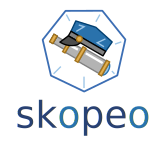

## Build

Buildah, Skopeo and Podman

---

## The problem

First, let's talk about our problem:

> A: It works on my machine.
> B: Let's ship your machine.

or

> A: What do I need to build it?
> B: nodejs in version x, 29 devel packages, 9 other packages, ...

---

## Docker to the rescue (Build)


Let's build it:

```bash
docker build .
```

This works, if Docker is running as a service.

---

## Docker to the rescue (Dockerfile)

```Dockerfile
FROM docker.io/library/node:16 as build

WORKDIR /app

COPY ember-sample/. /app/

RUN npm install
RUN ./node-modules/ember-cli/bin/ember build

FROM docker.io/library/httpd:2

COPY --from=build --chown=33:33 /app/dist/ /usr/local/apache2/htdocs/
```

---

## Docker in Docker

It's more like Docker executeable, mounting Docker from the host, but this
would be a weird name.

Mounting the `docker.sock` socket requires privilges (root).

It does not work if your Kubernetes runs on CRI-O, runc or containerd.

---

## What about Podman? (Build)


In Podman it's similar:

```bash
podman build .
```

---

## What about Podman (Explain)

Podman is:

- daemonless
- rootless
- docker-cli replacement
- systemd native
- can run/generate kubernetes manifests

Find it at [podman.io](https://podman.io).

---

## And Buildah? (Build)


```bash
buildah bud .
```

---

## And Buildah? (Explain)

But wait...

```bash
$ buildah from docker.io/library/node:16 as build
node-working-container

buildah copy node-working-container ember-sample app/
ae67b3b681a7e379e1c9fb35f2ff8283ddf83e5a219038019bbc6d51f80bf955
```

---

## And Buildah? (Explain 2)

And how does this help?

- build your own script
- with all the if-then-else you can imagine
- template your build
- also no daemon needed

Find it at [buildah.io](https://buildah.io).

---

## Skopeo someone? (Build)



Skopeo cannot build, but:

- remote copy
- remote inspect
- remote delete
- sync registries


Find it at [GitHub](https://github.com/containers/skopeo).

---

## One last thing

Podman, Buildah and Skopeo are already there in all Fedora and
RedHat-family Linux derivates.

They are also available as container images and installation
sources for all your needs.

---

## Thank you :heart:

Slides and example code at: <https://github.com/dschier-wtd/presentations/>.
