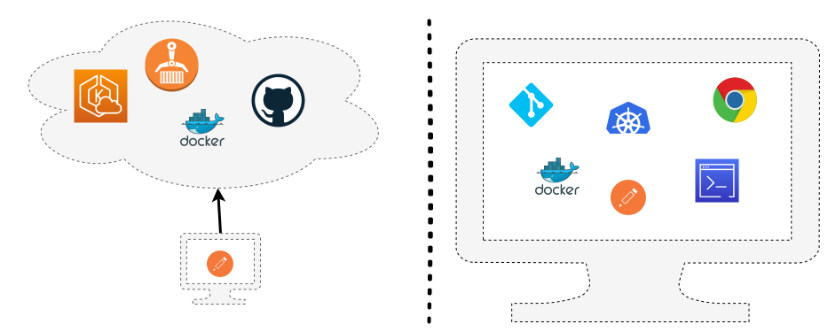

<div align="center">


# DevOps Ideals - Simplicity & Locality

A practical guide to simpler workflows and local build environments.

</div>

---

## :wave: Hi

- :man: Daniel Schier
- :computer: Some might say, I am a "DevOps engineer", ...
- :hammer: ... but I see myself as an IT craftsman.
- :floppy_disk: I am also contributing to Open Source, democratizing software.
- :pencil: I do some blogging, conferences and organize meetups.
- :heart: I love cats, cooking, coffee, cookies, computer thingies, ...
- :penguin: ... and penguins, of course.

---

## :clipboard: Agenda

Today, I want to talk about:

1. :muscle: WarmUp
2. :star: DevOps Ideals
3. :books: The project
4. :hammer: Let's do it
5. :clipboard: Summary

---

<div align="center">

# :muscle: WarmUp

Let's get the ball rolling.

</div>

---


### :speaker: DevOps in the audience

If you hear **DevOps**, what is in your mind?

---

## :tv: DevOps "in the media"


Just search for **DevOps**, and you will get:

- GitOps, DevSecOps, ChatOps
- Cloud, Kubernetes, Docker
- DevOps Toolchain
- CI/CD, Jenkins, Tekton
- Automation, Orchestration
- Agile, Stories, JIRA
- Platform engineering

---

<div align="center">

# :star: DevOps Ideals

One step back

</div>

---


## :star: DevOps Ideals

Let's take a step back. To the ideals.

1. Simplicity & Locality
2. Focus, Flow & Joy
3. Improvement of daily work
4. Psychological safety
5. Customer focus

---

## :star: Simplicity & Locality

Do we need to talk about simplicity?


---

## :star: Simplicity & Locality

Or locality?



---

## :star: Simplicity & Locality

The ideal of locality and simplicity states, that every workflow should be
simple, easy to follow and, in the best case, reproducible by a single person.

This can be achieved by:

- simple applications
- build in a Starbucks coffee shop in Madrid
- don't worry about complicated/central tooling
- stay in the repository
- easy processes

---

<div align="center">

# :books: The project

What do we want to do?

</div>

---

## :man: The user requested

Let's note down the work:

### Story

> As a user, I love to be greeted. Therefore, I would love to have a website
> that says something like "Hello" every time I call it.

### Acceptance Criteria

- user is greeted in english
- deployment to kubernetes
- tests and docs provided

---

## :man: The user requested

I don't know of any code-based issue tracker, but a simple `TODO.md` should do
the trick for now.

```markdown
<!-- TODO.md -->

- [ ] New hello service

  As a user, I love to be greeted. Therefore, I would love to have a website
  that says something like "Hello" every time I call it.

  - user is greeted in english
  - deployment to kubernetes
  - tests and docs provided
```

Alternatively, it might be a good idea to at least integrate your issue tracker
in your IDE.

---

<div align="center">

# :hammer: Let's do it

`Code` incoming, but it's not much.

Find more at <https://github.com/dschier-wtd/presentations/>

</div>

---

We start with some [Go](https://go.dev/):

```golang
func helloHandler(c echo.Context) error {
  ip := c.RealIP()
  host := c.Request().Host

  html := `<div align="center"><h1>Hello, DecompileD!</h1><p>You are visiting from ` + ip + `.<br>My address is ` + host + `.</p></div>`

  return c.HTML(http.StatusOK, html)
}

func healthHandler(c echo.Context) error {
  return c.String(http.StatusOK, "healthy")
}

func main() {

  e := echo.New()
  e.Use(middleware.Logger())
  e.Use(middleware.Recover())

  e.GET("/", helloHandler)
  e.GET("/health", healthHandler)

  e.Logger.Fatal(e.Start(":3000"))
}
```

---

Go can be ran and built locally:

```shell
# Run (for a simple WFM)
go run cmd/hello.go

# Build the binary
go build -v -o build/hello cmd/hello.go
```

---

We want containers for convenience:

```Dockerfile
FROM docker.io/library/golang:1.22 AS build

ENV CGO_ENABLED=0
COPY . .
RUN go build -v -o /build/hello cmd/hello.go

FROM scratch

COPY --from=build /build/hello /usr/local/bin/hello
EXPOSE 3000/tcp
CMD ["/usr/local/bin/hello"]
```

---

We can build these locally, too. In my case with [Podman](https://podman.io):

```shell
podman build -t hello .
```

---

Maybe some tests?

```golang
func TestHelloHandler(t *testing.T) {
  e := echo.New()
  req := httptest.NewRequest(http.MethodGet, "/", nil)
  rec := httptest.NewRecorder()
  c := e.NewContext(req, rec)

  // Call the handler
  err := helloHandler(c)
  if err != nil {
    t.Errorf("helloHandler returned an error: %v", err)
  }

  // Check the response
  assert.Equal(t, http.StatusOK, rec.Code)
}
```

---

We can test these locally (slowly getting the parttern?):

```shell
# Run unit tests
$ go test -v .

# Maybe with coverage?
$ go test -v -cover .
```

---

[hurl](https://hurl.dev/) is simple enough for functional testing:

```hurl
GET http://{{host}}/
GET http://{{host}}/health

HTTP 200
```

---

We can test this locally, too:

```shell
# Start
podman run -p 3000:3000 localhost/go-hello

# Smoke
curl localhost:3000
"Hello, World!"

# Functional
hurl --variable host=localhost:3000 tests/functional.hurl
```

---

Let's say "Security" is a thing, too.
[Trivy](https://www.aquasec.com/products/trivy/) is just another Go binary.

```shell
trivy fs --scanners vuln,secret,misconfig .
```

---

Now, what about a release?

```shell
# Tag properly
podman image tag localhost/go-hello docker.io/dschier/go-hello:latest

# Push to registry
podman image push podman image push docker.io/dschier/go-hello:latest
```

---

And maybe some deployment on Kubernetes?

```shell
$ tree kubernetes/
kubernetes/
├── deployment.yaml
├── ingress.yaml
├── namespace.yaml
└── service.yaml

1 directory, 4 files
```

---

We can run this locally, again:

```shell
# Start Minikube
minikube start
minikube addons enable ingress
minikube addons enable registry

# Deploy
kubectl apply -f kubernetes/

# Test it again
url 192.168.49.2
hurl --variable host=192.168.49.2 tests/functional.hurl
```

---

And finally some documentation with mkdocs.

```shell
# Python venv
python -m venv .venv
source .venv/bin/activate

# Install deps
pip install -r requirements.txt

# Build docs
mkdocs serve
```

---

Maybe a presentation with "marp"?

> Pssst, you are currently looking at one. Written in Markdown.

```markdown
---
marp: true
theme: "default"
author: "Daniel Schier"
title: "DevOps Ideals - Simplicity & Locality"
footer: "CC-BY SA 4.0 - by Daniel Schier @ DecompileD 2024"

paginate: true
---
```

---

Lastly, we show this stuff to somebody, right?

```shell
# Start ngrok
ngrok http 80
```

---

## :clipboard: Summary

Plan, Code, Build, Test, Release, Deploy

- we followed a software development lifecycle from Plan to Deploy
- we can code, build, test, release & deploy locally
- Go is super simple for small apps
- Containers are awesome
- Shown us lots of things we already knew

---

## :bulb: Inspiration

Possible Improvements?

- multi stage deployments
- scripted build/test/release
- addition of a CI/CD process (cirrus and GitLab can run locally)
- package kubernetes (Helm)
- security scans (trivy, kubelinter and more)
- way more docs
- Skaffold for convenience
- multi-arch builds (podman can do this, and Go, too)
- local AI support
- mocks for 3rd party services

---

## :gift: Advertisement

By the way, we have a huge community of DevOps enthusiasts, Agilists and FOSS
folks. We would love to meet you there, too.

- <https://www.meetup.com/de-DE/devops-sachsen/>
- <https://www.meetup.com/de-DE/ddos-usergroup/>
- <https://www.meetup.com/de-DE/agile-dresden/>

Also, there is the Chemnitzer Linux Days, next weekend.

- :penguin: <https://chemnitzer.linux-tage.de/2024/en>

---

## :heart: Thank you

You can find me all over the interwebs:

- 🐘 <https://fosstodon.org/@dschier>
- 🔧 <https://github.com/dschier-wtd>
- 🔧 <https://github.com/whiletruedoio>
- 🖋️ <https://blog.while-true-do.io>
- ✉️ [dschier@while-true-do.io](mailto:dschier@while-true-do.io)

Slides and example code at: <https://github.com/dschier-wtd/presentation/>.
