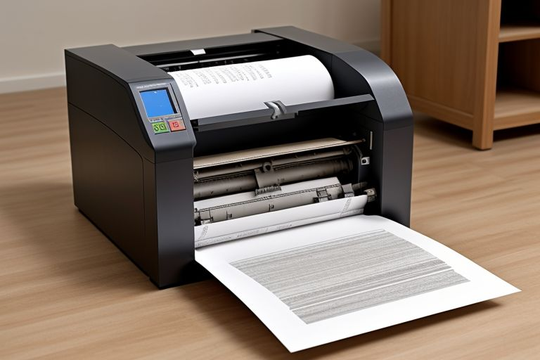

<div align="center">


# :books: plain/text - DevOps

Was ist eigentlich mit plain/text in einer DevOps Welt?

</div>

---


## :wave: Intro

- :man: **Daniel Schier**
- :hammer: IT Handwerker
- :floppy_disk: Open Source contributor
- :pencil: Blogger, Speaker, Meetups
- :heart: Katzen, Kochen, Kaffee, Kekse und Komputer Dinge, ...
- :penguin: Pinguine

---


## :clipboard: Agenda

1. :muscle: Aufwärmübungen
2. :memo: + :computer: plain/text und DevOps
3. :alarm_clock: Muss auch mal gut sein

---


<div align="center">

# :muscle: Aufwärmübungen

Zum Wach werden.

</div>

---

## :computer: Was ist DevOps?


Wenn ihr **DevOps** hört, was geht euch durch den Kopf?

---

## :memo: Was ist plain/text?


Ok, und wenn ihr plain-text hört?

---



<div align="center">

# :memo: + :computer: plain/text und DevOps

Wenn wir ein klein wenig Technologie zu Hilfe nehmen ...

</div>

---

## :calendar: Planung und Aufgaben

Da gibt es zum Beispiel todo.txt

```txt
x (A) 2023-12-13 2023-12-08 Write article about plaintext +blog @home
  (B)            2023-12-09 Check blog statistics +blog @home
```

Aber auch noch viele andere Formate, wie Tasker, Markdown, ...

---

## :books: Dokumentationen

Für Dokumentationen setze ich gern auf Markdown:

```markdown
# Heading 1

Some text

## Heading 2

Some more text.

- lists
- are
- possible

```

---

## :books: Dokumentationen

Diese kann ich auch ganz einfach als Webseite parsen, oder PDF exportieren. Zum
Beispiel mit mkdocs.

```yaml
---
# mkdocs.yaml

site_name: "DevOps Ideals"
theme: "material"
...
```

Darüber hinaus gibt es dann aber auch noch Docusaurus, Gitbook, ...

---

## :books: Dokumentationen

Oder, wir nehmen ASCII Doc für noch mehr Flexibilität:

```asciidoc
= Document Title

Some text

== Level 1 Section Title

Some more text.

* Edgar Allan Poe
* Sheri S. Tepper
* Bill Bryson
```

---

## :pencil: Blogging und Publishing

- Jekyll
- Hugo
- Deno
- Bookdown
- Leanpub

---

## :tv: Präsentationen

Präsentationen kann ich ebenfalls in Markdown machen. Zum Beispiel mit marp:

```markdown
---
marp: true
theme: "default"
author: "Daniel Schier"
title: "plain/text in DevOps"
header: ""
footer: "CC-BY SA 4.0 - Daniel Schier"

paginate: true
---
```

Es gibt aber auch noch Deckset, Remark und viele andere.

---

## :gear: Konfigurationen

Btw, die meisten Konfigurationen sind ebenfalls plain text:


```ini
; comment
# another comment

[section]

key = value
```

---

## :gear: Konfigurationen

Automatisierungsanweisungen und Orchestration auch:

```yaml
- name: Install ntpdate
  ansible.builtin.package:
    name: ntpdate
    state: present
```

```yaml
apiVersion: v1
kind: Namespace
metadata:
  name: development
  labels:
    name: development
```

---

## :star: Benefits?

Und was bringt uns das nun?

- wir bleiben in der IDE/dem Editor
- Dateien sind quasi überall lesbar
- Mensch und Maschine verstehen was wir wollen
- Doku, ToDos und mehr werden Teil des reviews

---


<div align="center">

# :alarm_clock: Genug für heute

Naja, fast. 2 Slides noch. Vielleicht 3.

</div>

---

## :bulb: Inspirationen

Da geht noch mehr mit plain/text, auch im analogen Leben.

- Bullet Journal
- ASCIIDoc für noch mehr Spaß
- Drawio für Diagramme
- Matrix, Teams, Slack
- Ghost Blog
- PDF exports (aka, Release)

---

## :candy: Werbung

### Auf der CLT2024

- Ansible Community Stand

### Meetups (meetup.com)

- Dresden OpenSource UserGroup
- DevOps Sachen
- Ansible Meetup Dresden
- KUberntes & Cloud Native User Group

---

## :mailbox: Kontakt

Fragen, Wünsche, Ängste, Sorgen und Nöte, bitte gern an:

- 🐘 <https://fosstodon.org/@dschier>
- 🔧 <https://github.com/dschier-wtd>
- 🔧 <https://gitlab.com/dschier>
- 🔧 <https://github.com/whiletruedoio>
- 🖋️ <https://blog.while-true-do.io>
- ✉️ [dschier@while-true-do.io](mailto:dschier@while-true-do.io)

Slides und Beispiele auf: <https://github.com/dschier-wtd/presentations/>.

---


<div align="center">

# :heart: Danke

Nein, wirklich. Danke für eure Aufmerksamkeit, Geduld, das Feedback und Kritik.

</div>
