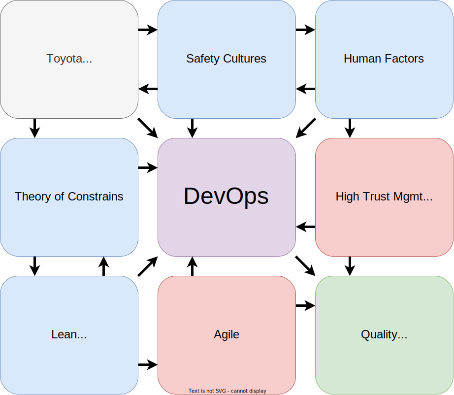

---

marp: true
theme: "default"
author: "Daniel Schier"
title: "DevOps Origins"
header: "DevOps Meetup Saxony"
footer: "CC-BY SA 4.0 - Daniel Schier"

paginate: true

style: |
  pre {
    border-radius: 10px;
    padding: 10px;
    box-shadow: rgba(0, 0, 0, 0.24) 0px 3px 8px;
    font-family: monospace;
  }
---

# DevOps Origins

How DevOps became a thing and what influenced its development.

---

## :wave: Hi

- :man: Daniel Schier
- Some might say, I am a "DevOps engineer", ...
- ... but I see myself as an IT craftsman.
- I am also contributing to Open Source, democratizing software.
- I do some blogging, conferences and organize meetups.
- I love to make nice memories, have a good conversation and learn new stuff.

---

### :speaker: DevOps in the audience

If you hear **DevOps**, what is in your mind?

---

## :tv: DevOps "in the media"

Just search for **DevOps**, and you will get:

- GitOps, DevSecOps, ChatOps
- Cloud, Kubernetes, Docker
- DevOps Toolchain
- CI/CD, Jenkins, Tekton
- Automation, Orchestration
- Agile, Stories, JIRA
- Platform engineering

---

## :star: DevOps Ideals

Let's take a step back. To the ideals.

1. Simplicity & Locality
2. Focus, Flow & Joy
3. Improvement of daily work
4. Psychological safety
5. Customer focus

---

## :books: But, how did this happen?

Let's take a peak behind the scenes.

---

---

---

## :heart: Thank you

You can find me all over the interwebs:

- 🐘 <https://fosstodon.org/@dschier>
- 🔧 <https://github.com/dschier-wtd>
- 🔧 <https://github.com/whiletruedoio>
- 🖋️ <https://blog.while-true-do.io>
- ✉️ [dschier@while-true-do.io](mailto:dschier@while-true-do.io)

Slides and example code at: <https://github.com/dschier-wtd/presentation/>.
